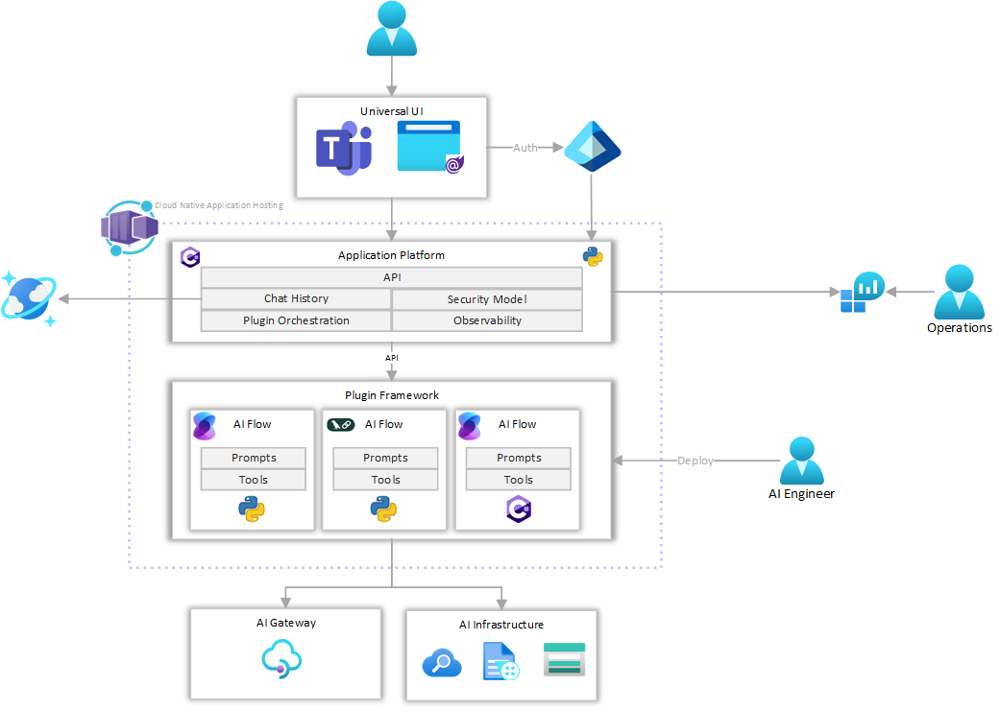
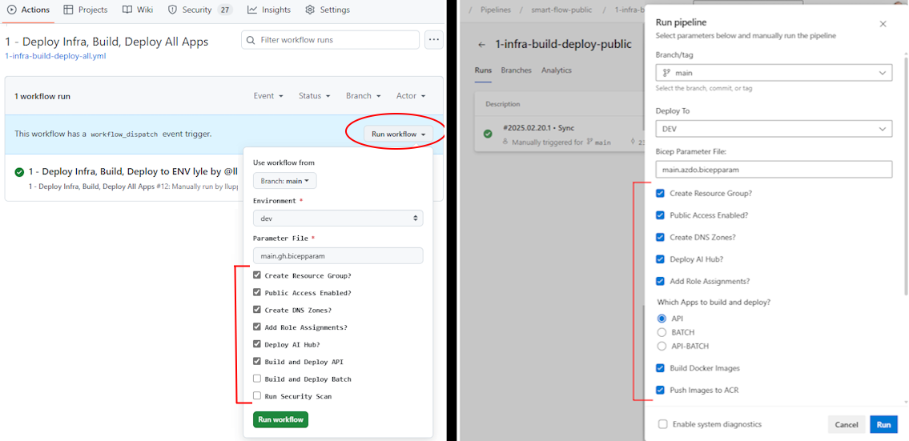

# Smart Flow API

This project is a demonstration of how to create a landing zone for AI powered agents, as well as an API that utilizes Semantic Kernel to create generic agentic workflows that call Azure OpenAI and other tools to analyze and validate information, providing automated feedback reports for actionable insights and remediation.

## Contents

* [Architecture and Overview](#architecture-and-overview)
* [Getting Started with IAC](#getting-started-with-iac-and-deployment)
* [Local Development](#application-development-and-refinement)
* [Refining the Prompts](#prompt-development)

## Architecture and Overview

The solution is deployed using Azure Container Apps to run the API application, and there are other companion repositories that can provide UIs in the form of a website, a Teams app, and a phone client that will interact with this API.



While developing this API, a Swagger interface and some simple REST Client API tests are provided to enable you to develop a working API that will use OpenAI tools to analyze documents and provide feedback. The prompts and processes are easily configurable and can be modified to suit your needs.


---

## Getting Started with IAC and Deployment

This project uses Infrastructure as Code (IaC) to deploy and manage the Azure resources, utilizing [Bicep](https://learn.microsoft.com/en-us/azure/azure-resource-manager/bicep/overview) to deploy Azure resources declaratively.

Automated workflows are included in the project for [GitHub Actions](./.github/github_setup.md), [Azure DevOps Pipelines](./.azdo/pipelines/readme.md) or [azd up](./docs/azd_deploy.md) to deploy the resources. The workflows are designed to be multi-environment, allowing you to deploy to different environments (DEV/QA/PROD) with different configurations, secrets, permissions and approvals.

In this initial demo, all deploys are triggered manually. Deploying to the QA and PROD environments could require approvals -- you will want to modify the workflows to suit your team's work standards.

In either case, to begin using this demo, you will need to:

1. Fork this repository (or import it into your own environment)
1. Create a service principal with rights to deploy resources
1. Configure some environment variables
1. Deploy the initial Azure resources
1. Start modifying the code to meet your requirements

When you deploy to Azure, you have several options for how to deploy the resources. Taking all the defaults will create a simple deploy that is public facing for quick and easy testing, and there are options to create a fully VNET enabled private site. In some cases when teams are given an existing Azure Resource Group, you may want to turn off the `Create Resource Group`, and `Add Role Assignments` as they could fail without the proper security.



For more details and to get started, choose one of the following setup guides:

* [GitHub Actions Setup](./.github/setup.md)
* [Azure DevOps Setup](./.azdo/pipelines/readme.md)
* [azd up](./docs/azd_deploy.md)

---

## Application Development and Refinement

After you have deployed the initial set of resources in Azure, you will want to set up a local development environment if you want to develop a new feature or fix issues.

## Running the Application

To run the base API application, open the [app/Assistant.Hub.Api/Assistant.Hub.Api.sln](./app/Assistant.Hub.Api/) in Visual Studio (or VS Code). The secrets that you need are defined as an example in the [app/Assistant.Hub.Api/appsettings.Template.json](./app/appsettings.Template.json) file.

You can set up the secrets in the user secrets by right-clicking on the Project and selecting `Manage User Secrets`, or you can add those values into the [appsettings.json](./app/Assistant.Hub.Api/appsettings.json) or appsettings.development.json file, ***(just be sure not to check those values into source control if you update the appsettings.json files!)***

> Tip: If you want to use `Manage User Secrets` in VS Code you can use [this extension](https://marketplace.visualstudio.com/items?itemName=adrianwilczynski.user-secrets).

Find your URL and key and deployment name for your resource instances, and then add those required keys to your secrets. If you are deploying using Managed Identities and you have the appropriate roles, the keys are optional.

The API Key is one that you will create so that when you test this API, you can use the key to validate that you are authorized to use the API.

```bash
"AOAIStandardServiceEndpoint": "https://<YOUR-INSTANCE>.openai.azure.com/",
"AOAIStandardChatGptDeployment": "gpt-4o"
"AOAIStandardServiceKey": "<yourKey-optional>",

"AzureDocumentIntelligenceEndpoint": "https://<YOUR-INSTANCE>.cognitiveservices.azure.com/",
"AzureDocumentIntelligenceKey": "<yourKey-optional>",

"AzureAISearchEndpoint": "https://<YOUR-INSTANCE>.search.windows.net/",
"AzureAISearchKey": "<yourKey-optional>",

"CosmosDbEndpoint": "https://<name>.documents.azure.com:443/",
"CosmosDbKey": ""

"StorageAccountName": "<STORAGE_ACCOUNT_NAME>",
"ContentStorageContainer": "data",

"ApiKey": "<CreateYourOwnApiKey>"
```

Now that the secrets are provisioned, run the API application and you should see it run on port 7179 (or some similar port).


Switch back to VS Code and open the [api-tests-image-review-request-prompt.http](app/Assistant.Hub.Api/api-tests-image-review-request-prompt.http) file. Update the port in the `@baseURL` variable, then click on the `Send Request` link, and you can run the tests to ensure the API is working correctly.


> Note: this documentation shows examples using VS Code, but you can also run each of these steps in VS or in VS Code, including executing the http test client.

---

## Prompt Development

The prompts in this application are stored in the [app/Assistant.Hub.Api/Services/Profile](./Services/Profile) folder. The prompts are stored in a JSON format in the [app/Assistant.Hub.Api/Services/Profile/profiles.json](./app/Assistant.Hub.Api/Services/Profile/profiles.json) file, and you can add new prompts or modify existing ones to suit your needs. Profiles that are defined in this file can be accessed via the `/api/task/{profileName}` endpoint.

### Example Prompts

#### Embedded File Prompt

You can create prompts in the Profile/Prompts subfolder and have them embedded in the application, as shown in the `auto-body-damage-analysis` profile which references the [AutoBodyDamageReviewSystemPrompt.txt](./app/Assistant.Hub.Api/Services/Profile/Prompts/AutoBodyDamageReviewSystemPrompt.txt) file and the [AutoBodyDamageReviewUserPrompt.txt](./app/Assistant.Hub.Api/Services/Profile/Prompts/AutoBodyDamageReviewUserPrompt.txt) file.

``` json
"SystemMessage": "embeddedFile::AutoBodyDamageReviewSystemPrompt",
"UserMessage": "embeddedFile::AutoBodyDamageReviewUserPrompt"
```

#### Inline Prompt

You can create prompt text directly in the profiles.json file, as shown in the `image-review-inline-prompt` profile.

``` json
"SystemMessage": "inline::You are a helpful assistant.",
"UserMessage": "inline::Evaluate the proposed image for..."
```

#### User Supplied Prompt

You can also allow the requestor to supply the prompt text directly, as shown in the `image-review-request-prompt` profile.

``` json
"SystemMessage": "request::SystemPrompt",
"UserMessage": "request::UserPrompt"
```

The profile definitions are up to you, so take these examples and to help you get started and get creative!

---

## References

* [Private Networking in Azure Container Apps environment](https://learn.microsoft.com/en-us/azure/container-apps/networking)
* [OpenAI: Questions and Answers using embeddings](https://cookbook.openai.com/examples/question_answering_using_embeddings)

---

[Back to top](#contents)
